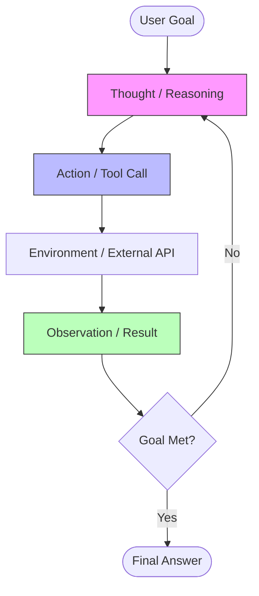
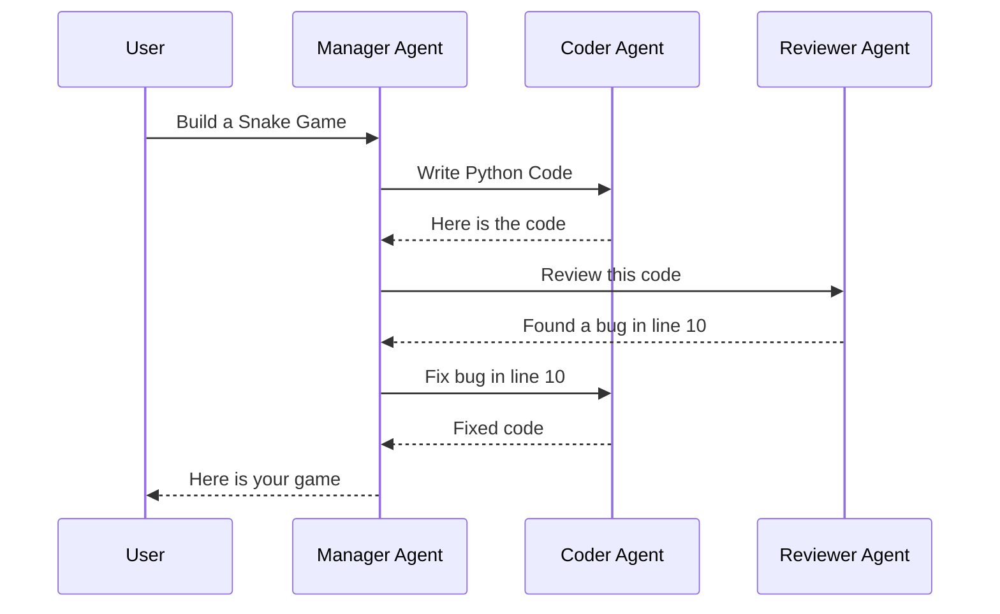

---
title: The Architecture of Modern AI Agents: From LLMs to Autonomous Systems
date: 2026-02-15
seo:
  metaTitle: AI Agents Architecture 2025 | ReAct, RAG & Autonomous Systems
  metaDescription: Deep dive into building production-ready AI agents using ReAct patterns, Vector Databases, and LLMs. Learn the architecture of 2025's AI systems.
  keywords:
    - AI Agents
    - LLM Architecture
    - ReAct Pattern
    - Vector Database
    - RAG
    - Autonomous Systems
  ogImage: /assets/ai-agents-cover.jpg
  canonicalUrl: https://aligivshadi.ir/#articles/ai-agents-2025
---

# The Architecture of Modern AI Agents: From LLMs to Autonomous Systems

The field of Artificial Intelligence has moved rapidly from simple text generation (Chatbots) to autonomous systems capable of reasoning and executing complex tasks (Agents). In this deep dive, we will explore the architectural patterns that power the next generation of AI applications in 2025.

## 1. The Agentic Workflow

Unlike a standard LLM call which is a linear Input -> Output process, an Agent operates in a loop. It perceives, reasoning, acts, and then observes the result of its action.

### The Core Loop (ReAct Pattern)

The **ReAct** (Reasoning + Acting) pattern is the foundation of modern agents.



## 2. Memory Systems

LLMs are stateless. To build coherent agents, we need external memory.

### Short-term Memory (Context Window)
This is limited by the model's context size (e.g., 128k tokens). It holds the immediate conversation history and current reasoning steps.

### Long-term Memory (Vector Databases)
For retrieving information from millions of documents or past experiences, we use Vector Databases (RAG).

```python
# Pseudo-code for a Memory Module
class AgentMemory:
    def __init__(self):
        self.vector_db = Pinecone.connect(...)
        self.history = []

    def retrieve(self, query):
        embedding = openai.embed(query)
        # Search for semantically similar past experiences
        docs = self.vector_db.query(embedding, top_k=3)
        return docs
        
    def add(self, user_input, agent_response):
        self.history.append({"role": "user", "content": user_input})
        # Asynchronously archive to vector DB if important
        self.vector_db.upsert(agent_response)
```

## 3. Tool Use & Function Calling

An agent is only as powerful as its tools. Modern LLMs are fine-tuned to detect when to call a function.

> [!IMPORTANT]
> Always define strict JSON schemas for your tools. The ambiguity in tool definition is the #1 cause of agent failure.

### Example: A Weather Tool Schema

```json
{
  "name": "get_current_weather",
  "description": "Get the current weather in a given location",
  "parameters": {
    "type": "object",
    "properties": {
      "location": {
        "type": "string",
        "description": "The city and state, e.g. San Francisco, CA"
      },
      "unit": {
        "type": "string",
        "enum": ["celsius", "fahrenheit"]
      }
    },
    "required": ["location"]
  }
}
```

## 4. Multi-Agent Orchestration

For complex tasks, a single agent often gets confused. The solution is **Multi-Agent Systems**, where specialized agents collaborate.

### Vertical Architecture (Manager-Worker)



## 5. Production Challenges

Moving from a demo to production is hard.

| Challenge | Solution |
| :--- | :--- |
| **Latency** | Use speculative decoding and faster/smaller models (e.g., Llama-3-8B) for simple sub-tasks. |
| **Hallucination** | Implement "Reflexion" steps where the agent critiques its own output before showing it. |
| **Loops** | Set a maximum iteration depth (e.g., 10 steps) to prevent infinite loops. |
| **Cost** | Cache tool results and common queries. |

## 6. Future: Generalized Autonomy

We are moving towards "Level 3" Agents: systems that can be given a high-level goal (e.g., "Increase my Twitter followers by 10%") and run for days, generating their own sub-tasks, adjusting strategies, and reporting back only when necessary or when success is achieved.

> [!TIP]
> Start simple. A single agent with 3 robust tools is often better than a complex swarm of 10 mediocre agents.
