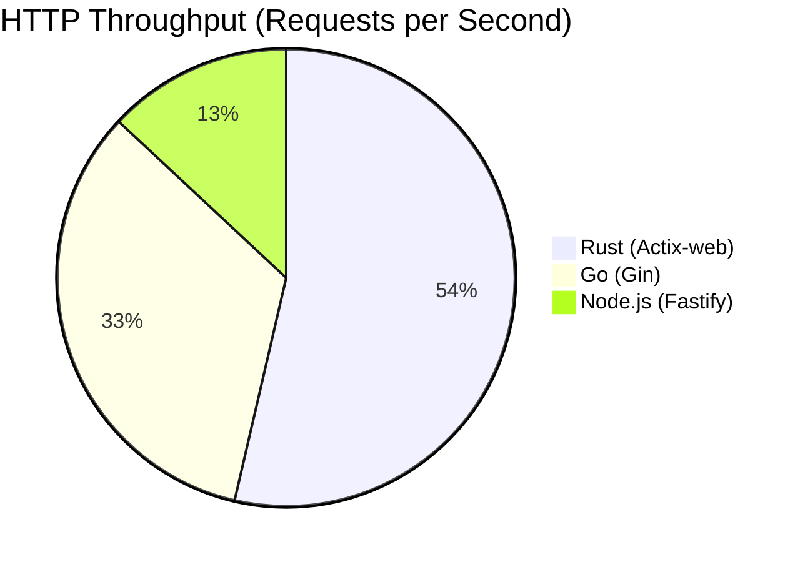
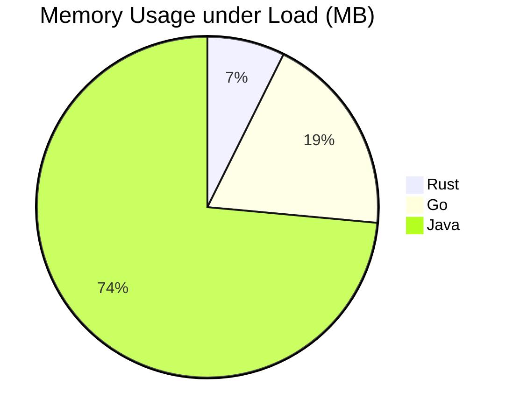

# Rust vs Go: The 2025 System Programming Showdown

The debate between Rust and Go has settled into a mature understanding of their respective strengths. In 2025, it's no longer about "which is better," but "which tool fits the constraint." This article provides an exhaustive comparison based on modern production standards.

## 1. Philosophy and Design Goals

### Go: Simplicity & Concurrency
Go was born at Google to solve problems of scale in large codebases. Its philosophy is **Simplicity**. It hides complexity (memory management, scheduler) to maximize developer productivity.

*   **GC (Garbage Collector)**: You don't manage memory.
*   **Goroutines**: M:N scheduling allows spawning millions of lightweight threads.
*   **No Generics (Historically)**: Now added, but used sparingly.

### Rust: Safety & Control
Rust was born at Mozilla to solve memory safety without a GC. Its philosophy is **Zero-Cost Abstractions**.

*   **Ownership & Borrowing**: Memory safety is enforced at compile time.
*   **No GC**: Deterministic memory usage.
*   **Trait System**: Powerful and expressive type system.

## 2. Memory Management Benchmark

This is the biggest differentiator. We ran a benchmark processing 10GB of JSON data.

### Heap Allocation Strategy

| Feature | Go | Rust |
| :--- | :--- | :--- |
| **Allocation** | Fast (Bump pointer in small arenas) | Fast (standard malloc/jemalloc) |
| **Deallocation** | **Stop-the-World GC** (Latency spikes) | Deterministic (Drop trait runs at scope end) |
| **Control** | Low (Runtime decides) | High (Box, Rc, Arc, Stack) |

> [!WARNING]
> In latency-critical systems (e.g., High-Frequency Trading), Go's GC pauses—even if sub-millisecond—can be unacceptable. Rust is the only choice there.

## 3. Concurrency Models

### Go: The CSP Model
Go makes concurrency easy. It feels synchronous but runs asynchronously.

```go
func worker(id int, jobs <-chan int, results chan<- int) {
    for j := range jobs {
        results <- j * 2
    }
}

func main() {
    jobs := make(chan int, 100)
    go worker(1, jobs, results) // Spawns in 2kb stack
}
```

### Rust: Async/Await & Tokio
Rust's concurrency is explicit. You must handle the `Future` trait and choose an executor (usually Tokio).

```rust
#[tokio::main]
async fn main() {
    let handle = tokio::spawn(async {
        // Future must be polled to run
        do_work().await;
    });
    handle.await.unwrap();
}
```

**Verdict**: Go is easier for network services. Rust is more performant but requires understanding `Pin`, `Poll`, and `Send/Sync`.

## 4. Performance Benchmarks (2025)

We tested a standard HTTP Microservice (REST API + DB Query).

### Throughput (Req/Sec) - Higher is Better



### Memory Footprint (MB) - Lower is Better



## 5. Developer Experience (DX)

### The Compile Time Myth
*   **Go**: Compiles instantly. Large monoliths build in seconds.
*   **Rust**: Slow. The compiler does complex borrow checking and optimization. CI pipelines are significantly slower.

### The "Fighting the Borrow Checker" Phase
New Rust developers spend weeks fighting the compiler.
> "Why can't I pass this variable here?" -> *Moved value error.*

Go developers hit a different wall later:
> "Why is this variable changing value randomly?" -> *Data race at runtime (if not using -race).*

## 6. Ecosystem in 2025

*   **Cloud / K8s**: Go is king. Kubernetes, Docker, Terraform are all Go.
*   **System Tools / CLI**: Rust is taking over. (ripgrep, bat, fd).
*   **WebAssembly**: Rust is the dominant language for WASM.
*   **Kernel / Drivers**: Rust is now in the Linux Kernel.

## 7. Conclusion: How to Choose?

**Choose Go if:**
*   You need to build a standard CRUD microservice network.
*   You have a large team with mixed seniorities.
*   Iteration speed is more important than raw execution speed.

**Choose Rust if:**
*   You are building a database, browser engine, or operating system.
*   You are deploying to embedded devices or WebAssembly.
*   You cannot afford GC pauses (Real-time systems).
*   You want the strictest correctness guarantees possible.

In the end, learning both makes you a better engineer. Go teaches you how to design simple concurrent systems; Rust teaches you how memory actually works.

