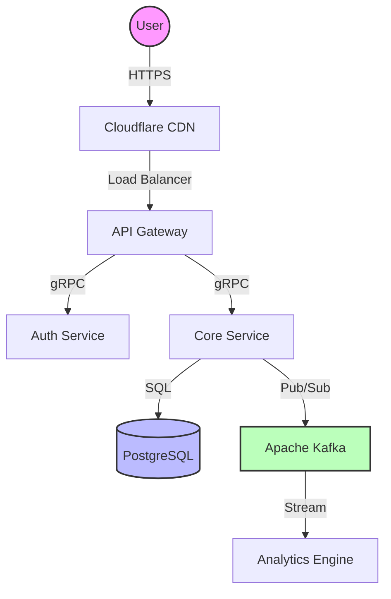
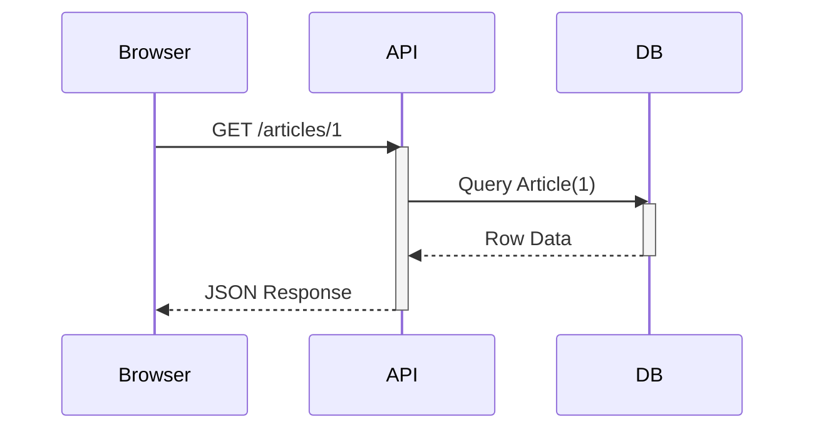
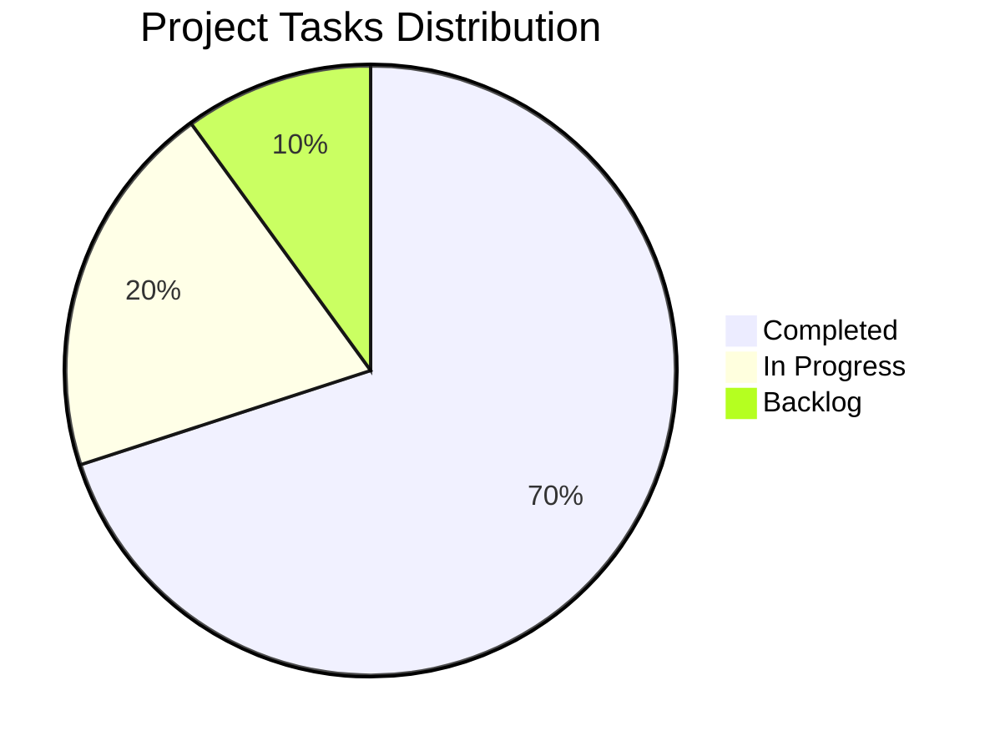

# Ultra-Advanced Article Reader Showcase

This article demonstrates the full capabilities of our new rendering engine. It supports everything from **Live Diagrams** to **LaTeX Equations** and **Raw HTML**.

## 1. Live Diagrams (Mermaid.js)

We can now render complex diagrams directly from code blocks.

### A. System Architecture (Flowchart)



### B. Request Lifecycle (Sequence Diagram)



### C. Project Status (Pie Chart)



---

## 2. Advanced Typography & Math

We fully support **LaTeX** for mathematical expressions.

The mass-energy equivalence formula is $E = mc^2$.

A more complex integral:

$$
\int_{-\infty}^{\infty} e^{-x^2} dx = \sqrt{\pi}
$$

### Strikethrough & Formatting
*   ~~Deleted Text~~
*   **Bold Text**
*   *Italic Text*
*   `Inline Code`

> **Note:** This is a blockquote. It supports **Markdown** inside it.

---

## 3. Data Tables (Responsive)

Tables now have sticky headers, striped rows, and are scrollable on mobile.

| Metric | Server A | Server B | Difference |
| :--- | :---: | :---: | ---: |
| **CPU Usage** | 45% | 12% | -33% |
| **Memory** | 16GB | 32GB | +100% |
| **Uptime** | 99.9% | 99.99% | +0.09% |
| **Cost** | $50/mo | $120/mo | +$70 |

---

## 4. Mac-Style Code Blocks

Code blocks now look like macOS terminal windows with copy buttons.

### TypeScript (React)
```tsx
import React, { useState } from 'react';

export const Counter = () => {
  const [count, setCount] = useState(0);

  return (
    <button onClick={() => setCount(c => c + 1)}>
      Count is: {count}
    </button>
  );
};
```

### Python (Data Science)
```python
import pandas as pd
import numpy as np

def calculate_metrics(df):
    """Calculates ROI from the dataframe."""
    df['roi'] = (df['revenue'] - df['cost']) / df['cost']
    return df.describe()
```

### JSON (Config)
```json
{
  "app_name": "SuperPortfolio",
  "version": "3.0.0",
  "features": ["dark_mode", "pwa", "offline_support"]
}
```

---

## 5. Raw HTML & Embeds

We can embed raw HTML components, like this interactive-looking button or custom badges.

<div style="display: flex; gap: 10px; margin: 20px 0;">
  <button style="background: linear-gradient(45deg, #FF0080, #7928CA); border: 0; border-radius: 50px; color: white; padding: 10px 20px; font-weight: bold; cursor: pointer;">
    Custom HTML Button
  </button>
  <span style="background: #e1f5fe; color: #0288d1; padding: 10px 15px; border-radius: 8px; font-weight: bold;">
    HTML Badge
  </span>
</div>

<details>
<summary><strong>Click to reveal secret HTML details</strong></summary>
<p>This content is hidden inside a native HTML <code>details</code> tag. It works perfectly within the markdown reader!</p>
</details>

<br/>


---

## 6. GitHub-Style Alerts

> [!NOTE]
> This is a standard note for the user. Useful for general information.

> [!TIP]
> Pro Tip: You can swipe left on articles in the list view to archive them!

> [!WARNING]
> Warning: This action cannot be undone. Proceed with caution.

> [!IMPORTANT]
> This is crucial information that you must read before continuing.

